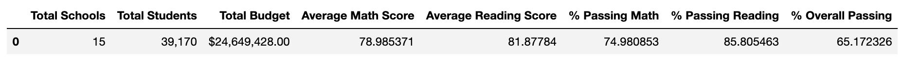
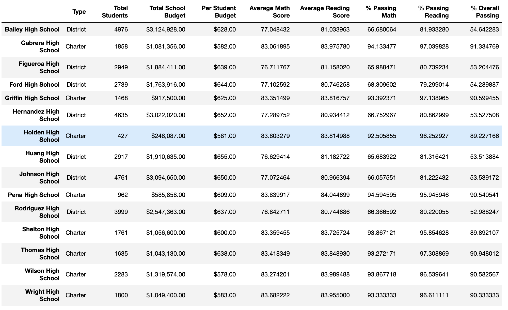

# Module 4 Challenge

## Table of Contents

- [About](#about)
- [Getting Started](#getting_started)
- [Installing](#installing)
- [Report](#report)
- [Conclusions](#conclusions)
- [Result Screenshots](#result_screenshots)

## About

You are the new Chief Data Scientist for your city's school district. In this capacity, you'll be helping the school board and mayor make strategic decisions regarding future school budgets and priorities.

As a first task, you've been asked to analyze the district-wide standardized test results. You'll be given access to every student's math and reading scores, as well as various information on the schools they attend. Your task is to aggregate the data to showcase obvious trends in school performance.

#### 1) District Summary & School Summary
Perform the necessary calculations to create DataFrames summarizing key metrics for both the district and each school.
- Total number of unique schools
- Total students
- Total budget
- Average math score
- Average reading score
- % passing math (the percentage of students who passed math)
- % passing reading (the percentage of students who passed reading)
- % overall passing (the percentage of students who passed math AND reading)

#### 2) Highest & Lowest-Performing Schools (by % Overall Passing)
#### 3) Math & Reading Scores by Grade
#### 4) Scores by School Spending
- Average math score
- Average reading score
- % passing math (the percentage of students who passed math)
- % passing reading (the percentage of students who passed reading)
- % overall passing (the percentage of students who passed math AND reading)

#### 5) Scores by School Size
#### 6) Scores by School Type

## Getting started

You will find a folder named **PyCitySchools**. In that folder there is a **Resources** folder that includes 2 **.csv** files, and a **PyCitySchools_completed.ipynb** script file..

## Installing

1) To get started, open Jupiter Notebook through Anaconda or any other navigator.
2) Open the **PyCitySchools_completed.ipynb** file.  
3) Run the code.
4) It should print the results in the output terminals.

## Report

### District Summary

- Total Schools: 15
- Total Students: 39,170
- Total Budget: $24,649,428.00
- Average Math Score: 78.99%
- Average Reading Score: 81.88%
- % Passing Math: 74.98%
- % Passing Reading: 85.81%
- % Overall Passing: 65.17%

### School Summary

- Top Performing School: Cabrera High School
- Lowest Performing School: Rodriguez High School
- Average Math Score by Grade:
  - 9th: 78.94%
  - 10th: 78.94%
  - 11th: 79.08%
  - 12th: 78.99%
- Average Reading Score by Grade:
  - 9th: 81.91%
  - 10th: 81.87%
  - 11th: 81.89%
  - 12th: 81.77%

### Scores by School Spending:

- Spending Range (<$585):
  - Average Math Score: 83.46%
  - Average Reading Score: 83.93%
  - Overall Passing Rate: 93.46%
    
- Spending Range ($585-630):
  - Average Math Score: 81.90%
  - Average Reading Score: 83.16%
  - Overall Passing Rate: 87.13%
    
- Spending Range ($630-645):
  - Average Math Score: 78.52%
  - Average Reading Score: 81.62%
  - Overall Passing Rate: 73.48%

- Spending Range ($645-680):
  - Average Math Score: 77.00%
  - Average Reading Score: 81.03%
  - Overall Passing Rate: 66.16%

### Scores by School Size:

- Small (<1000):
  - Average Math Score: 83.82%
  - Average Reading Score: 83.93%
  - Overall Passing Rate: 94.82%

- Medium (1000-2000):
  - Average Math Score: 83.37%
  - Average Reading Score: 83.86%
  - Overall Passing Rate: 94.12%

- Large (2000-5000):
  - Average Math Score: 77.75%
  - Average Reading Score: 81.34%
  - Overall Passing Rate: 68.65%

### Scores by School Type:

- District:
  - Average Math Score: 76.96%
  - Average Reading Score: 80.97%
  - Overall Passing Rate: 66.55%

- Charter:
  - Average Math Score: 83.47%
  - Average Reading Score: 83.90%
  - Overall Passing Rate: 93.62%

## Conclusions

### School Type Impact on Performance:
When examining the impact of school type on academic performance, it's evident that Charter schools consistently outperform District schools across various metrics:
1) Average Math and Reading Scores:
Charter schools have higher average math and reading scores compared to District schools.

2) Passing Rates:
Charter schools exhibit significantly higher passing rates for both math and reading when compared to District schools.

3) Overall Passing Rate:
Charter schools also boast a higher overall passing rate when considering both math and reading scores together.

- These findings strongly indicate that the type of school is a critical factor influencing student performance,  with Charter schools consistently delivering better educational outcomes.
  
### Spending per Student and Performance:
The analysis of spending per student versus academic performance highlights an interesting trend:

1) Lower Per-Student Budget and Higher Academic Performance:
Schools with a lower per-student budget (<$585) tend to achieve higher average math and reading scores compared to schools with higher per-student budgets.

- This underscores the point that greater financial investment does not necessarily translate to improved academic achievements.

## Result Screenshots

*Caption: District Summary.*

*Caption: Per School Summary.*
